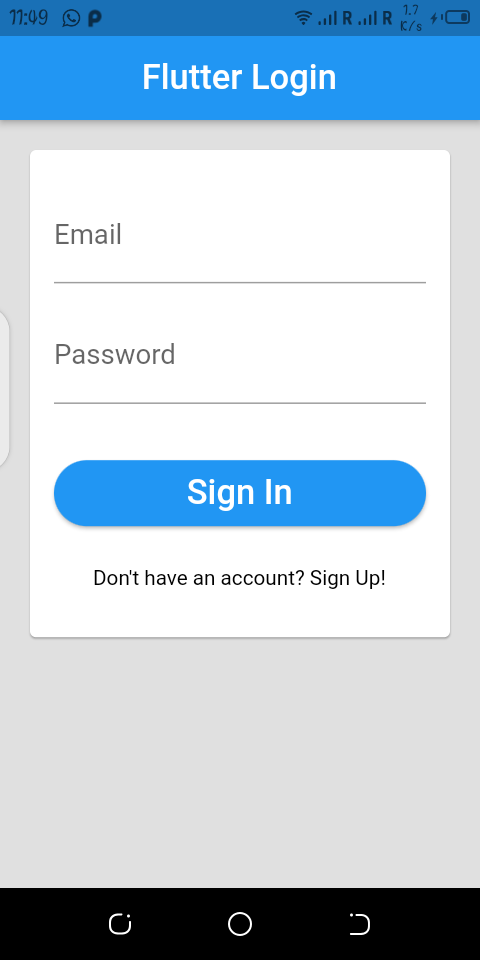
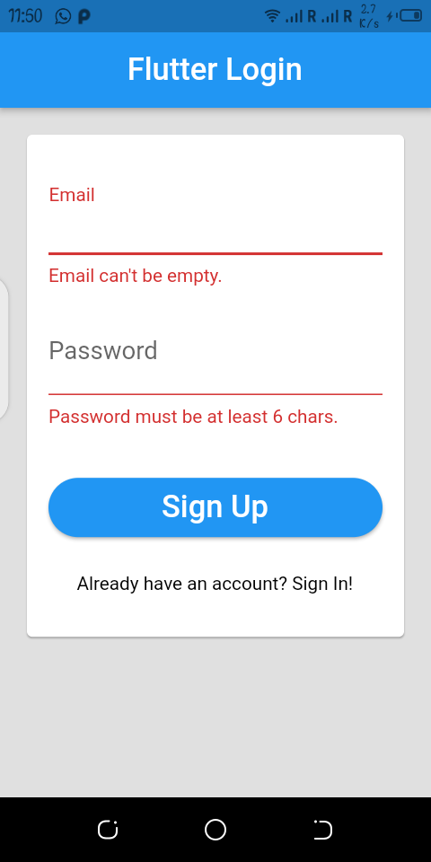
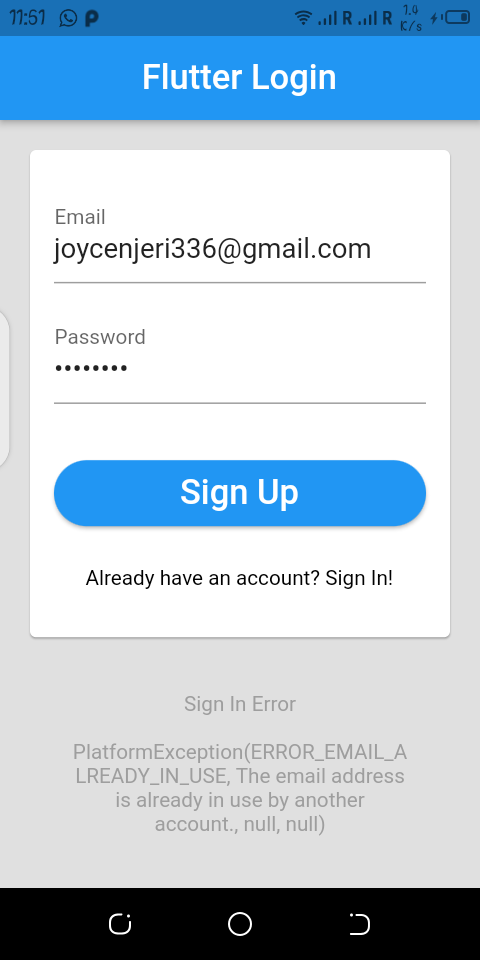
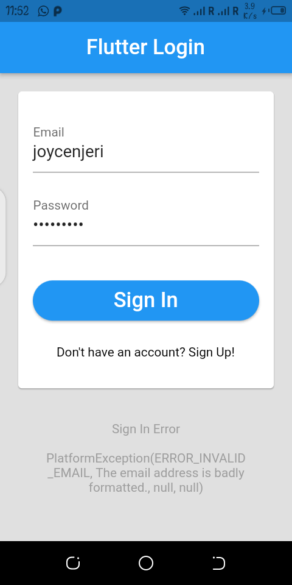
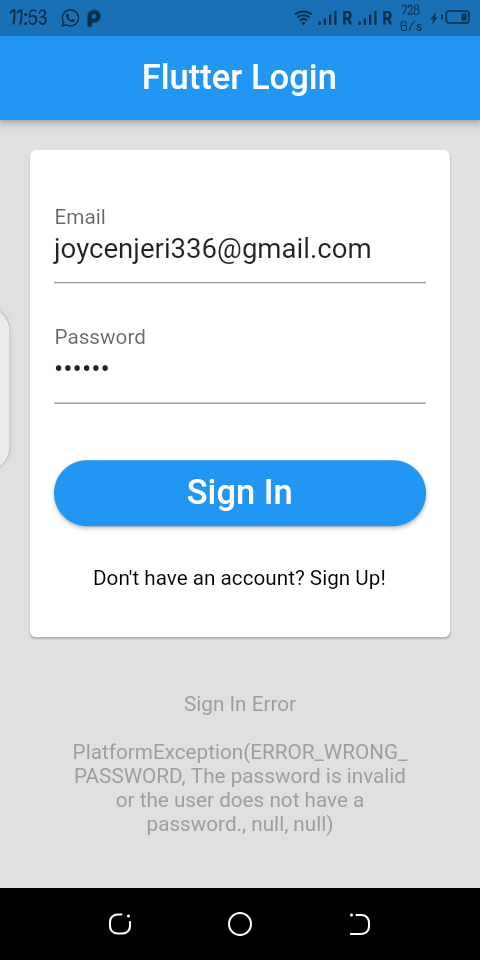

# Week 9,10 & 11 Class Activity

## Week 9

### Login Form with Firebase Authentication

#### How it works:

* User can enter their email and password
* When login is tapped, the input fields are validated
* If the email or password is invalid, they are highlighted in red
* If both email and password is correct, they are used to sign in with Firebase 

#### Logic:

* In the build() method, we create a Form to hold two TextFormFields (for email and password) and a RaisedButton (our sign in button).
* The email and password fields have a simple validator that returns false if the email is empty, and the password has less than 6 chars
* When the Login button is tapped, the validateAndSubmit() method is called.
* This calls validateAndSave(), which validates the fields inside the form, and saves the _email and _password.
* If validateAndSave() returns true, we call Firebase.instance.signInWithEmailAndPassword() to sign in the user.
* Once this call returns, we set the _authHint string. This is wrapped in a setState() method to schedule a rebuild of the SignInPage widget and update the UI.
* The buildHintText() method uses the _authHint string to inform the user of the authentication result.

## Week 10

### Sign In Button Package

Sign In Button is a Flutter plugin for generating sign in buttons for different social media accounts.

### How it works:

* You must add the library as a dependency to your project.
* You should then run flutter packages get
* Then, import library in your Dart code

## Week 11

### Widget Testing

For widget testing, we'll be testing the following scenarios:

* If the email is empty or the password is less than 6 chars when the user taps on the login button, then we don't attempt to sign in with Firebase and the confirmation message is empty.

* If the email and password are both non-empty and they do match an account on Firebase when the user taps on the login button, then we attempt to sign in with Firebase

* If the email and password are both non-empty and they do not match an account on Firebase when the user taps on the login button, then we attempt to sign in with Firebase and we show a failure confirmation message

## Preview

### User Interface

### Register

### Sign In

### Successful Login: Home Page

